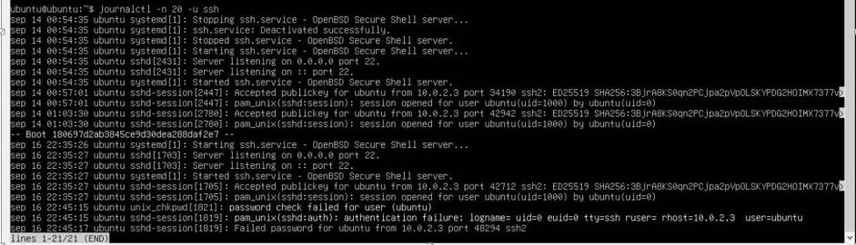
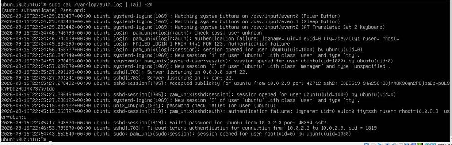
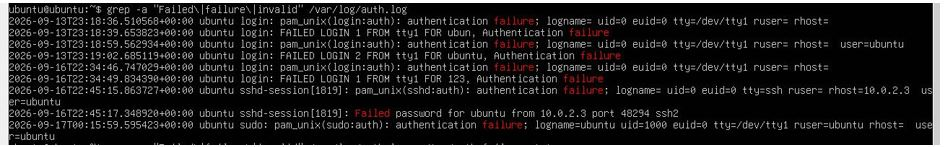
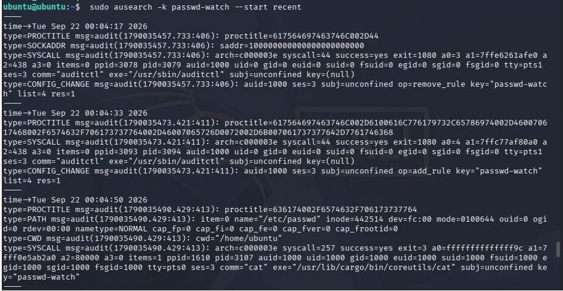

# 03 - Visibilidad: análisis de logs y auditoría del sistema

**Fecha:** 2026-09-21/22
**Autor:** Ludmila Ramirez
**Categoría:** Visibilidad / Detección

---

## 1. Objetivo

Familiarizarse con las principales fuentes de logs de un servidor Linux y
desarrollar la capacidad de filtrar eventos relevantes para una investigación
de seguridad, usando herramientas nativas del sistema operativo sin depender
de soluciones externas.

## 2. Contexto / Escenario

Antes de simular ataques, un analista SOC necesita saber **qué tiene para ver**
en un sistema. Esta práctica cubre las tres fuentes de telemetría más
importantes de un servidor Linux: el journal del sistema, el log de
autenticación y el subsistema de auditoría del kernel.

## 3. Entorno utilizado

| Máquina | Rol | IP |
|---|---|---|
| Ubuntu Server 24.04 LTS | Servidor objetivo | 10.0.2.9 |
| Kali Linux | Cliente / atacante simulado | 10.0.2.3 |

**Herramientas:** `journalctl`, `grep`, `/var/log/auth.log`, `auditd`, `ausearch`

---

## 4. Procedimiento

### 4.1 journalctl — log del sistema

`journalctl` es el log centralizado de systemd. Permite filtrar por servicio,
por boot anterior, por prioridad y por rango de tiempo.

Ver los últimos 50 eventos del sistema:

```bash
journalctl -n 50
```

Ver los últimos 20 eventos del servicio SSH específicamente:

```bash
journalctl -n 20 -u ssh
```


**Estructura de cada línea:**

```
sep 16 22:34:59  ubuntu  systemd[1518]:  Listening on snapd...
   [fecha/hora]  [host]  [proceso[PID]]:  [mensaje]
```
En las ultimas lineas se registro el intento fallido desde Kali.

### 4.2 /var/log/auth.log — log de autenticación

Es el log clásico de Unix. Registra **todo** lo relacionado a autenticación
en un solo archivo: logins, intentos fallidos, uso de sudo, sesiones PAM,
accesos por consola y por SSH. Es el primero que mira un analista cuando
sospecha un compromiso de credenciales.

Ver las últimas 20 líneas:

```bash
sudo cat /var/log/auth.log | tail -20
```


#### Filtrado por tipo de evento

Para filtrar únicamente los eventos de autenticación fallida (lo que buscaría
un analista al inicio de una investigación):

```bash
grep -a "Failed\|failure\|invalid" /var/log/auth.log
```


- `grep` busca texto dentro de un archivo
- `-a` fuerza el tratamiento como texto aunque el archivo tenga caracteres especiales
- `"Failed\|failure\|invalid"` busca líneas que contengan cualquiera de esas tres palabras (`\|` = operador OR)

#### Preservar evidencia

Para guardar el resultado en un archivo en lugar de mostrarlo en pantalla
(práctica estándar para preservar evidencia en el estado actual del log):

```bash
grep -a "Failed\|failure\|invalid" /var/log/auth.log > /tmp/auth-failures.txt
```

#### Filtrado por fecha

Filtrar todos los eventos de un día específico:

```bash
grep -a "2026-09-16" /var/log/auth.log
```

Combinar filtro de fecha con filtro de eventos fallidos (doble filtro con pipe):

```bash
grep -a "2026-09-16" /var/log/auth.log | grep -a "Failed\|failure"
```


El `|` (pipe) encadena dos búsquedas: primero filtra por fecha, y sobre ese
resultado aplica el segundo filtro. Esto es lo que usaría un analista cuando
le dicen "revisá qué pasó el día X".

### 4.3 Generación de evento de prueba

Desde Kali, se intentó un login SSH con autenticación por contraseña
(deshabilitada durante el hardening de la práctica anterior):

```bash
ssh -o PubkeyAuthentication=no ubuntu@10.0.2.9
```

El intento falló como se esperaba, y quedó registrado en los logs del servidor.

### 4.4 auditd — auditoría a nivel kernel

`auditd` es el demonio de auditoría del kernel. A diferencia de `auth.log` y
`journalctl`, registra **acciones dentro del sistema**: qué archivos se tocaron,
qué comandos se ejecutaron, qué permisos se cambiaron.

| Herramienta | Registra |
|---|---|
| `auth.log` | Intentos de autenticación (quién entró, quién falló) |
| `journalctl` | Eventos de servicios (arranque, fallo, reinicio) |
| `auditd` | Acciones a nivel kernel (acceso a archivos, ejecución de binarios, cambios de permisos) |

**Instalación:**

```bash
sudo apt install auditd -y
```

**Verificar que está corriendo:**

```bash
sudo systemctl status auditd
```

#### Crear una regla de auditoría

Vigilar el archivo `/etc/passwd` (lista de usuarios del sistema) y registrar
cualquier lectura:

```bash
sudo auditctl -a always,exit -F path=/etc/passwd -F perm=r -k passwd-watch
```

- `-a always,exit` → registrar siempre, al salir de la syscall
- `-F path=/etc/passwd` → vigilar este archivo
- `-F perm=r` → solo lecturas
- `-k passwd-watch` → etiqueta para poder buscar estos eventos fácil después

#### Generar un evento de prueba

```bash
cat /etc/passwd > /dev/null
```

#### Buscar el evento en el log

```bash
sudo ausearch -k passwd-watch --start recent
```

---



---

## 5. Hallazgos / Resultados

### Intento fallido desde Kali (auth.log)

El login fallido desde Kali (`10.0.2.3`) quedó registrado en tres líneas separadas:

```
unix_chkpwd[1821]: password check failed for user (ubuntu)
pam_unix(sshd:auth): authentication failure; logname= uid=0 tty=ssh rhost=10.0.2.3 user=ubuntu
sshd-session[1819]: Failed password for ubuntu from 10.0.2.3 port 48294 ssh2
```

Datos clave que quedaron registrados: IP de origen, usuario intentado, puerto
y método de autenticación.

### Evento de lectura de /etc/passwd (auditd)

El evento capturado con `ausearch` mostró:

```
time→Tue Sep 22 00:04:50 2026
comm="cat"  exe="/usr/lib/cargo/bin/coreutils/cat"
name="/etc/passwd"  uid=1000  key="passwd-watch"
```

`auditd` registró que a las 00:04:50, el usuario con UID 1000 (`ubuntu`) ejecutó
`cat` sobre `/etc/passwd`.

Un hallazgo adicional: los eventos posteriores mostraron que el propio comando
`ausearch` (ejecutado con `sudo`) también quedó registrado accediendo a
`/etc/passwd` para buscar los eventos, junto con el proceso `unix_chkpwd`
verificando la contraseña de sudo. **auditd registra incluso la búsqueda de
evidencia.**

---

## 6. Análisis

La diferencia entre las tres herramientas queda clara en la práctica:

- `journalctl -u ssh` mostró el reinicio del servicio SSH y los logins
  exitosos, pero no los fallidos con detalle
- `auth.log` + `grep` permitió aislar rápidamente los eventos de autenticación
  fallida de todo el ruido del sistema, aplicando filtros por tipo de evento
  y por fecha
- `auditd` capturó el acceso al archivo `/etc/passwd` con un nivel de detalle
  que los otros dos no tienen: binario exacto ejecutado, UID, timestamp preciso

El doble filtro con pipe (`grep fecha | grep error`) es una técnica fundamental:
en un log de producción real la diferencia puede ser entre revisar 20 líneas
o 20.000 para encontrar lo mismo.

El nivel de detalle de `auditd` es relevante para MITRE ATT&CK **T1087.001**
(Account Discovery: Local Account) — acceder a `/etc/passwd` es una técnica
clásica de reconocimiento post-compromiso, y `auditd` es la herramienta que
permite detectarlo.

---

## 7. Remediación / Contención

No aplica (práctica de visibilidad y detección, no de respuesta a un incidente
activo). Las reglas de `auditctl` creadas en esta práctica son temporales
(se pierden al reiniciar). En la siguiente fase se configurarán reglas
persistentes en `/etc/audit/rules.d/`.

---

## 8. Lecciones aprendidas

- Un analista SOC no lee logs de arriba a abajo, los **filtra**. Saber qué
  palabras clave buscar (`Failed`, `failure`, `invalid`, `error`, `refused`)
  es tan importante como saber dónde están los logs.
- `auditd` registra la búsqueda de evidencia también — en un entorno real
  esto es valioso para la cadena de custodia: quedará registrado quién
  investigó qué archivo y cuándo.
- Las tres herramientas son complementarias, no alternativas. En una
  investigación real se usarían las tres en conjunto: `journalctl` para
  entender el estado de los servicios, `auth.log` para los accesos, y
  `auditd` para las acciones sobre archivos y binarios.

---

## 9. Referencias

- [Linux Audit Documentation](https://github.com/linux-audit/audit-documentation)
- [MITRE ATT&CK T1087.001 - Account Discovery: Local Account](https://attack.mitre.org/techniques/T1087/001/)
- [Ubuntu manpage: ausearch](https://manpages.ubuntu.com/manpages/noble/man8/ausearch.8.html)
